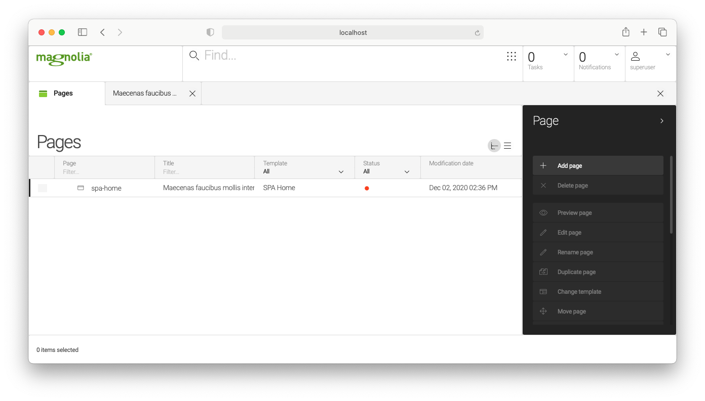
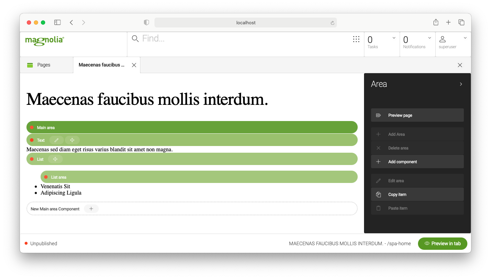

# mgnl-spa-react

## What

- `spa` - basic React app
- `spa-lm` - light module to add to Magnolia

# How to build spa

1. Run npm install
2. Run build script `scripts/build.sh`
3. Make sure `build` folder in light module is updated

# How to add page in Magnolia

1. Make sure your Magnolia bundle can see `spa-lm` light module
2. Create new page with template `SPA Home` in Pages app with name `spa-home`

